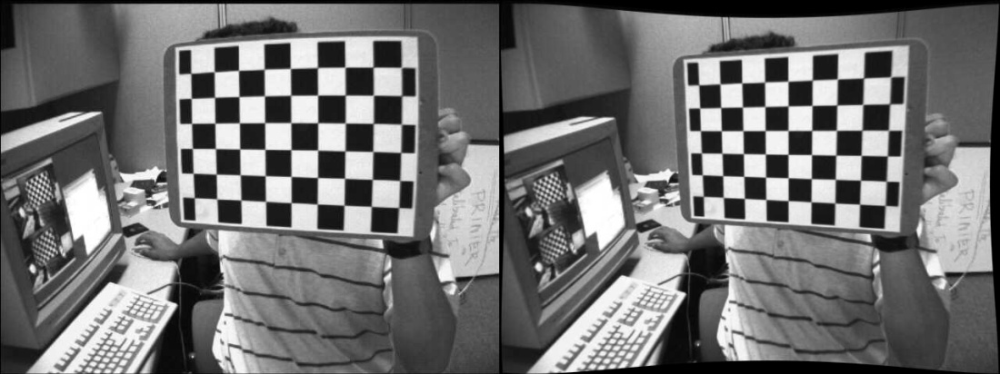
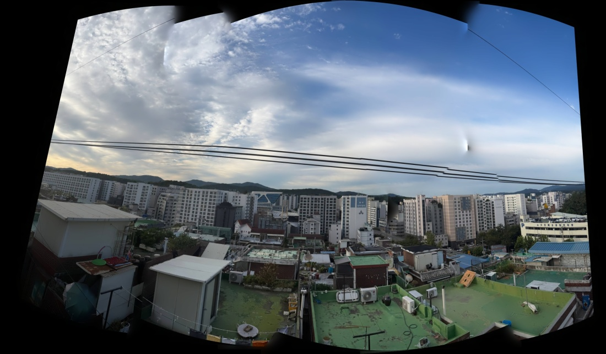
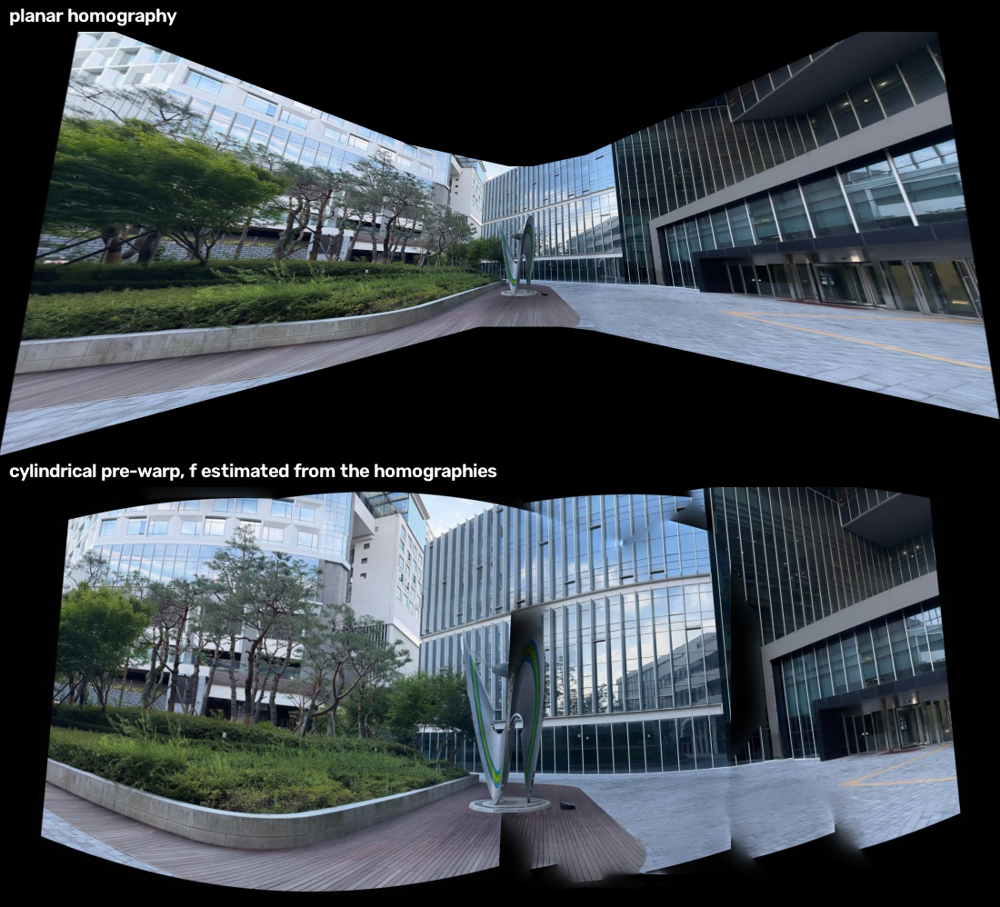
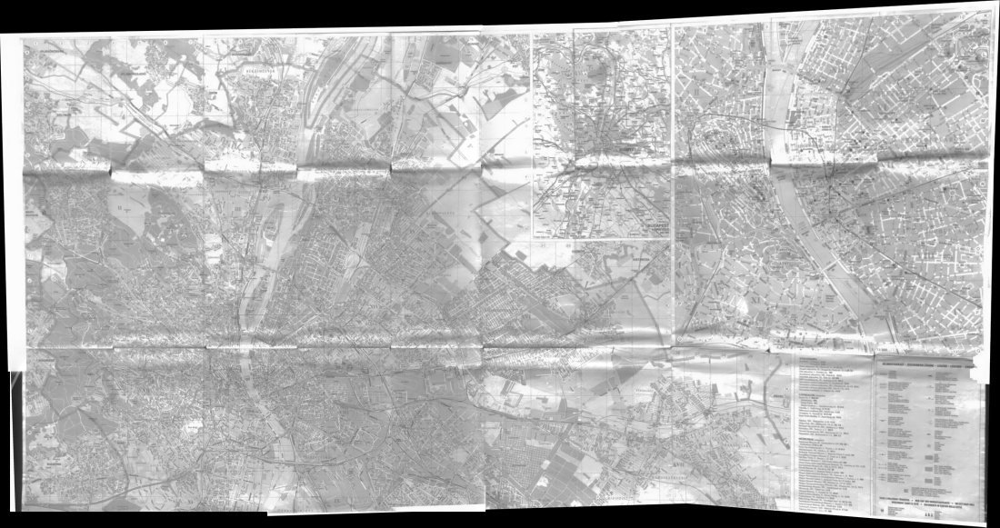
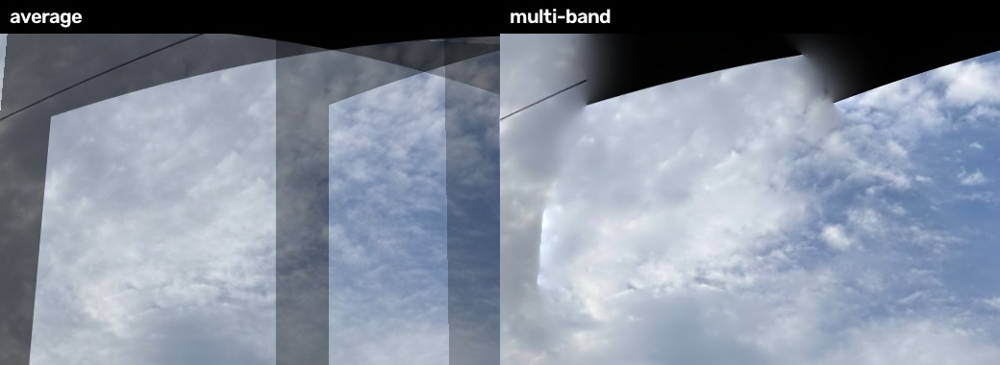

# calib-stitch-toolkit

[](https://github.com/dilwolf/calib-stitch-toolkit/actions/workflows/ci.yml)

Camera calibration and panorama stitching built from OpenCV primitives, with the
intermediate results measured rather than asserted.

Every number below came out of the scripts in `src/`. Nothing is copied from a
tutorial, and where something does not work I have said so.

---

## Pinhole calibration

13 views of a 9x6 board at 640x480 (`src/calibrate.py`).

**The images are OpenCV's public `left01-14` sample set, not my own camera.**
`src/fetch_data.py` pulls them, so every number in this section reproduces
exactly on a clean clone rather than depending on hardware only I have.

The interesting part is not the fit, it is the iteration. One view reprojects an
order of magnitude worse than the rest:

```
per-view RMS, all 13 views          RMS 0.4087 px
  left02.jpg  1.2198   <-- drop
  left13.jpg  0.4620
  everything else      0.15 - 0.31
after dropping left02               RMS 0.2341 px
```

Dropping a single bad view cuts the overall error by 43%, and moves `k1` from
-0.2651 to -0.2759. Final estimate:

| | value |
|---|---|
| views used | 12 / 13 |
| RMS reprojection error | **0.2341 px** |
| fx, fy | 534.13, 534.19 |
| cx, cy | 342.84, 233.72 (image centre 320.0, 240.0) |
| k1, k2, k3 | -0.275878, 0.004823, 0.180196 |
| p1, p2 | 0.001252, 0.0000151 |

`fx` and `fy` agree to 0.06 px, which is what square pixels should look like.
`cx` sits 23 px right of centre — real, and consistent across refits.

Per-view errors are pooled as `sqrt(mean(e^2))` and asserted to reproduce the
RMS `calibrateCamera` reports. Dividing the residual norm by `N` instead of
`sqrt(N)` is the easy slip and it silently understates the error.

**On square size:** the source images do not document theirs, which costs
nothing here. `K` and the distortion coefficients are invariant to it — square
size only sets world scale, so it lands entirely in `tvecs`. It is set to 1.0
and the extrinsics are in board units.

---

## Undistortion



Same public sample set as above. `alpha=1`, so the whole frame is kept and the
correction is visible as curvature at the border.

The point of `src/undistort.py` is the split in cost:

| | |
|---|---|
| build remap tables (`initUndistortRectifyMap`) | 5.8 ms, **once** |
| `remap` per frame, 640x480 | **1.30 ms** (~770 fps, one core) |

Which is the whole argument for doing it this way: at ~1.3 ms a frame you can
undistort roughly 25 camera streams at 30 fps on a single core, because the
expensive part never repeats.

The correction is also measured rather than eyeballed. Each row of the board
should image as a straight line, so the RMS deviation of its corners from a
best-fit line is exactly the distortion the model failed to remove:

| | RMS deviation from a fitted line |
|---|---|
| distorted | 0.601 px |
| undistorted | **0.085 px** (86% lower) |

---

## Fisheye model validation (synthetic)

**No fisheye lens was used here.** Kannala-Brandt distortion is applied with
known coefficients and then recovered (`src/synth_fisheye.py`). That is a weaker
claim about hardware but a stronger one about the estimator: ground truth is
known exactly, so the error is measured instead of judged by eye.

A pinhole model cannot substitute. It projects `r = f·tan(θ)`, which diverges as
θ → 90°, so it cannot represent a hemispherical lens at all. Kannala-Brandt uses
`r = f·θ`, stays finite, and carries four radial terms and no tangential ones.

Poses are pushed out to a **median 36.3° incidence angle (max 66.4°)**. This
matters: if the board only ever sits near the optical axis the higher radial
terms are unconstrained, and "recovering" `k3`/`k4` from that means nothing.

40 views, 2160 points:

| corner noise σ | RMS | RMS/σ | fx err | cx err | cy err | max abs err in k |
|---|---|---|---|---|---|---|
| 0.00 px | 0.00000 | – | 0.0000 | 0.0000 | 0.0000 | 2.3e-14 |
| 0.10 px | 0.13755 | 1.375 | 0.441 | 0.065 | 1.188 | 1.3e-02 |
| 0.25 px | 0.34388 | 1.376 | 1.102 | 0.121 | 2.843 | 3.2e-02 |
| 0.50 px | 0.68777 | 1.376 | 2.255 | 0.124 | 5.161 | 6.3e-02 |

`RMS/σ` is constant to three decimals, which is what a well-conditioned
estimator should do — the residual tracks the observation noise and nothing else.

`cy` error grows about 40x faster than `cx`. That is not a bug: the poses span
±620 mm horizontally against ±380 mm vertically, so the principal point is
simply better constrained in x. Pose diversity showing up as a number.

### The initialisation trap

`cv2.fisheye.calibrate` does not survive realistic corner noise from a cold
start. Reproducible with `--cold-start`:

| σ | cold start | seeded with `f = max(w,h)/π` |
|---|---|---|
| 0.00 px | ok | ok |
| 0.10 px | **returns fx off by 320 px, no error raised** | fx err 0.441 |
| 0.25 px | asserts in `InitExtrinsics` | fx err 1.102 |
| 0.50 px | asserts in `InitExtrinsics` | fx err 2.255 |

At σ=0.1 px it silently reports `k1 = 3.38` against a true `-0.032`. The
crash is the *good* failure mode; the quiet one is what would ship. Seeding `K`
with the focal length a hemispherical lens would have converges at every level
tested.

---

## Panorama stitching



Five frames of a campus courtyard, hand-held, rotating from one spot.
`src/stitch.py` does detect → ratio-test match → RANSAC homography → common
canvas → seam → blend.

### Why cylindrical



A homography maps onto a plane, and a plane cannot hold a wide field of view —
the outer images stretch without bound. Same five inputs, same content:

| projection | canvas | total |
|---|---|---|
| planar homography | 5608 x 2556 | 6.0 s |
| cylindrical pre-warp | **2334 x 1055** | 3.2 s |

5.8x less canvas area for the same picture.

That needs a focal length before any warping can happen, so it is estimated from
the pairwise homographies: for a camera that only rotates, `H = K R K⁻¹`, and
with square pixels and a centred principal point `f` drops out in closed form.
Eight estimates over four pairs, **median 817.6 px** (72.5° horizontal FOV),
spread 526–872. Seven of the eight land within 40 px of each other and one pair
reports 526, so the median is taken rather than the mean — a single badly
conditioned pair should not move the warp.

`cv2.detail.focalsFromHomography` exists but writes through reference
parameters, which the Python binding cannot express, so it returns `None`. The
relations are written out in `focal_from_homography`.

### Why a match graph, not a chain

The second scene is a photographed paper map in a 2x3 grid, and it broke the
naive version outright. Chaining homographies in filename order assumes the
inputs are an ordered sweep. They were not:

```
pairwise inliers        0     1     2     3     4     5
    0                   -   470     0   976   297     0
    1                 470     -   889   268   871   499
    2                   0   889     -     0   533  1081
    3                 976   268     0     -   502     0
    4                 297   871   533   502     -   830
    5                   0   499  1081     0   830     -
```

Images 2 and 3 are adjacent by filename and share **nothing**. The sequential
chain walks straight through that pair, fits a homography to noise, and every
image after it is placed by it — the panorama comes out as a smear.

`--graph` matches all pairs and orders them by a maximum spanning tree over
inlier count instead. On this scene it routes around the dead pair entirely and
mean inlier ratio goes 79.1% → **91.3%**.



This is also why the two scenes are both valid: a homography is exact for pure
rotation (the courtyard) *or* for a planar scene (the map). Different
justifications, same algebra.

### Why multi-band, not averaging



Crop chosen automatically as the region where the two blends disagree most.

Averaging over the overlap ghosts on any exposure difference. Multi-band blends
low frequencies over a wide band and high frequencies over a narrow one, so
exposure differences vanish without smearing detail. Measured as gradient energy
along the seam divided by gradient energy over the whole panorama — 1.0 means
the seam is indistinguishable from ordinary scene detail:

| scene | multi-band | average |
|---|---|---|
| courtyard, SIFT | 0.970 | 1.269 |
| courtyard, ORB | 0.892 | 1.292 |
| map, SIFT | 0.957 | 1.200 |
| map, ORB | 0.971 | 1.219 |

### Benchmark

Courtyard, 5 x 1200x900, cylindrical + graph:

| method | good | inliers | inlier % | match/pair | align | blend | total | canvas |
|---|---|---|---|---|---|---|---|---|
| SIFT | 1085 | 846 | 77.7 | 0.218 s | 3.14 s | 0.14 s | 3.27 s | 2334x1055 |
| ORB | 1102 | 955 | **86.5** | **0.067 s** | 1.54 s | 0.12 s | 1.66 s | 2337x1089 |
| `cv2.Stitcher` | – | – | – | – | – | – | **0.82 s** | 2122x849 |

Map, 6 x 1142x806, graph:

| method | good | inliers | inlier % | match/pair | align | blend | total | canvas |
|---|---|---|---|---|---|---|---|---|
| SIFT | 946 | 863 | **91.3** | 0.258 s | 5.58 s | 0.42 s | 6.00 s | 2397x1265 |
| ORB | 518 | 470 | 90.4 | **0.077 s** | 2.83 s | 0.32 s | 3.15 s | 2464x1296 |
| `cv2.Stitcher` | – | – | – | – | – | – | **0.95 s** | 1692x1140 |

ORB matches about 3x faster than SIFT on both scenes. Which one is *more
accurate* does not survive the change of scene: on the courtyard ORB is ahead on
inlier ratio, 86.5% against 77.7%, while on the map it is a point behind and
finds barely half as many usable matches (518 against 946).

The map is low-texture and mostly fine printed line work, which suits SIFT's
scale-space; the courtyard is full of high-contrast window frames and building
edges, which is what a corner detector like ORB is built for. Two scenes are not
enough to rank the detectors, and the useful conclusion is the opposite of a
ranking: pick per scene, and measure rather than assume SIFT wins because it is
the more expensive algorithm.

**`cv2.Stitcher` is 2–6x faster than this implementation and I have not tried to
hide that.** It does its seam finding and blending at reduced resolution and
bundle-adjusts all cameras together instead of composing pairwise transforms.
The point of this repo is the parts, not beating the library.

---

## Design notes

- Undistortion maps are built once and reused; per frame it is one `remap`. That
  is the only reason it is viable across many cameras at once.
- Homographies chain to the **middle** image, not the first. Every hop compounds
  its own error and anchoring on an end doubles the longest chain.
- RANSAC over least squares for homography: least squares minimises over every
  match including the wrong ones, so a handful of bad pairs drags the whole fit.
- Lowe's ratio test keeps a match only when the best candidate clearly beats the
  second best. A descriptor matching two places equally well is ambiguous, and
  ambiguous matches are what wreck the homography.

## Limitations

- No bundle adjustment. Transforms compose pairwise along a spanning tree, so
  error still accumulates with tree depth; `cv2.Stitcher` optimises all cameras
  jointly and it shows on longer sequences.
- No exposure compensation before blending. Multi-band hides a lot of it, but
  it is treating the symptom.
- `--graph` matches all pairs, O(n²) in image count. Fine to a couple of dozen
  images; past that you would gate pairs on a global descriptor first.
- The fisheye work is synthetic. It validates the estimator, not a lens.
- Calibration runs on a public set, not my own camera. `src/fetch_data.py`
  pulls it so the numbers above reproduce exactly.

## Run

```bash
python -m venv .venv && .venv/Scripts/activate   # source .venv/bin/activate on unix
pip install -r requirements.txt
python src/fetch_data.py

python src/calibrate.py --max-err 1.0
python src/undistort.py --alpha 1
python src/synth_fisheye.py
python src/synth_fisheye.py --cold-start          # the failure above

python src/stitch.py --images data/pano --cylindrical auto --graph
python src/benchmark.py --images data/pano --cylindrical --graph
pytest -q
```

Point `--images` at your own folder to stitch your own set. Three to five frames
from a fixed position with roughly 30% overlap, or any flat surface
photographed in pieces.

Tested on Python 3.13 with `opencv-contrib-python` 5.0.0. `opencv-python`
without contrib will import and then fail at SIFT and at the `detail_` blending
modules.
